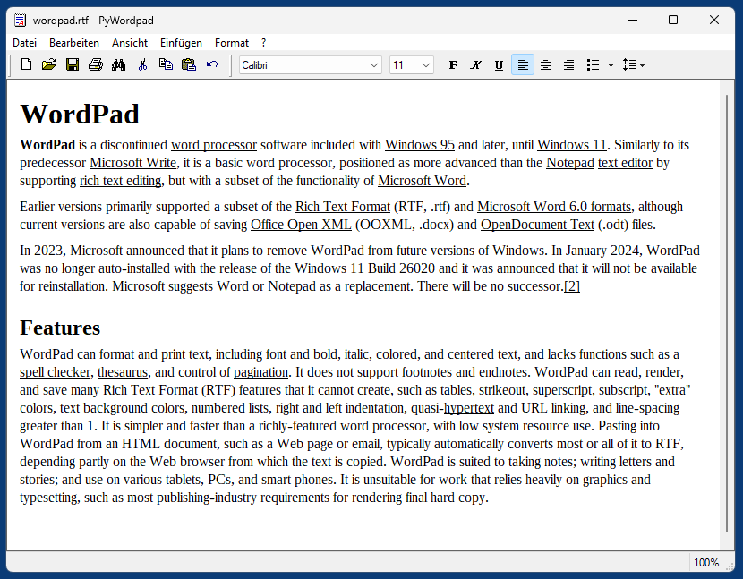
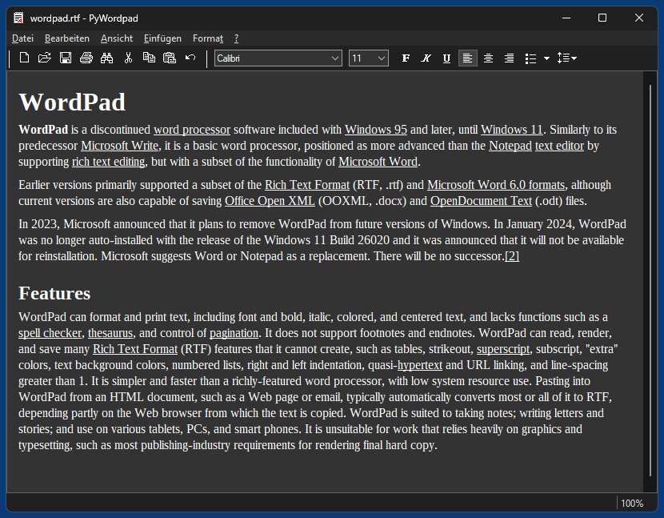

# PyWordpad
A clone of classic (pre Win 7) MS Wordpad written in pure Python, based on native Win32 controls and ctypes (Petzold style).

## Differences to original Wordpad

* No tab stop ruler (but tab stops can be edited per paragraph via tabs dialog)
* No print preview
* No support for embedded OLE objects (pointless), only images. Images can be embedded either by dropping them into the editor, via menu or via clipboard.
* Dropping a document into the editor loads the document (instead of embedding it).
* No editing of colors, it's meant for b/w documents (otherwise dark mode would't work)
* Natively supported document formats: .rtf and .txt. If "pandoc.exe" is found in the system path, the following document formats are also supported: .docx .odt .md .htm .epub
* Natively supported image format: .bmp. If "magick.exe" (ImageMagick) is found in the system path, the following image formats are also supported: .jpg .png .gif .tif
* Localized only for english and german (more languages can be added by duplicating and editing .json files in the resources folder)
* PyWordpad supports dark mode.

## Screenshots

*PyWordpad in Windows 11*  

*PyWordpad in Windows 11 (Dark Mode)*  

